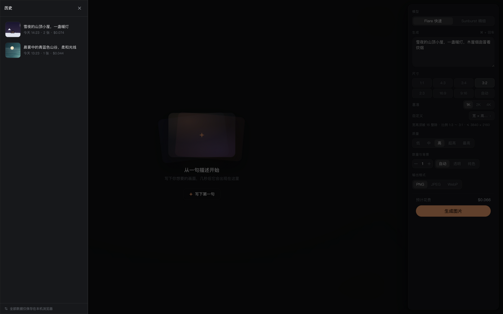
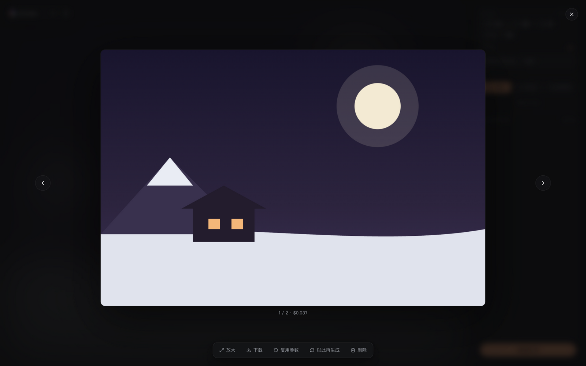

# PicMake

**纯前端、数据全留本地的 GPT Image 2.5 图片生成工作台。** 无后端、无账号、无遥测——浏览器直连你自己配置的 API（OpenAI 官方，或任意 OpenAI 格式兼容中转站），生成的图片与花费记录只存在你的浏览器里。


## 特性

- **完整参数控制**：模型（Flare / Sunburst）、任意比例尺寸、自定义分辨率（16 整除校验）、五档质量、张数、背景（自动/透明/纯色）、输出格式（PNG/JPEG/WebP），预计花费实时可见
- **流式渐进预览**：生成过程模糊→清晰逐步呈现，体验对齐 ChatGPT 原生；流式不可用时自动降级为普通请求
- **本地历史**：所有作品与花费记录存 IndexedDB，可随时回看、复用参数再生成、灯箱大图轮播
- **中转站友好**：API 地址可配、`/v1` 自动归一化；流式失败自动降级；异步任务型中转（返回 `task_id` 需轮询）也能正确处理，且绝不重发请求避免重复计费
- **高成本确认**：最高档位 / 大尺寸生成前弹确认框，防止手滑烧钱

| 首次运行 | 生成面板 |
|---|---|
|  |  |

| 历史抽屉 | 灯箱 |
|---|---|
|  |  |

## 快速开始

```bash
pnpm install
pnpm dev        # http://localhost:5173
```

首次打开填入 API 地址与 Key（支持官方 `https://api.openai.com/v1` 或兼容中转站），点「测试连接」验证后即可开始生成。

## 部署

构建产物为纯静态文件，任意静态托管可用。仓库已带两家平台的配置：

**Vercel** — [vercel.com/new](https://vercel.com/new) 导入仓库即可，[`vercel.json`](./vercel.json) 已指定 Vite 构建与输出目录；或 CLI：`npx vercel`

**Cloudflare Pages** — Dashboard → Workers & Pages → 创建 Pages → 连接本仓库，构建命令 `pnpm build`、输出目录 `dist`（[`wrangler.toml`](./wrangler.toml) 已声明）；或直接上传：`pnpm build && npx wrangler pages deploy dist`

环境要求：Node ≥ 20.19、pnpm ≥ 10（见 `.nvmrc` / `package.json#engines`）。

## 隐私与安全边界

- **API Key 只存在浏览器 localStorage**，仅在请求头 `Authorization` 中发往你配置的地址；本应用无任何第三方上报、埋点、遥测
- **图片与历史只存 IndexedDB**，无服务端存储；清除浏览器数据即彻底删除
- 作为纯前端应用，Key 暴露在同源 XSS 风险下——请只在你信任的环境中使用，不要在公共设备上保存 Key

## 技术栈

Vite 8 · React 19 · TypeScript · Tailwind CSS v4 · HeroUI v3 · Zustand · Dexie（IndexedDB）· eventsource-parser（SSE 解析）。网络层为原生 fetch 封装（错误归一化 + 流式 + 自动降级），不引 axios / openai SDK，依赖刻意压到最少。

## License

[MIT](./LICENSE)
