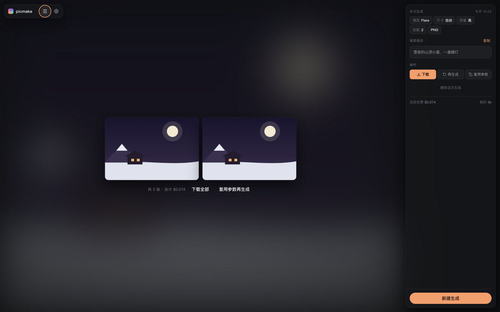
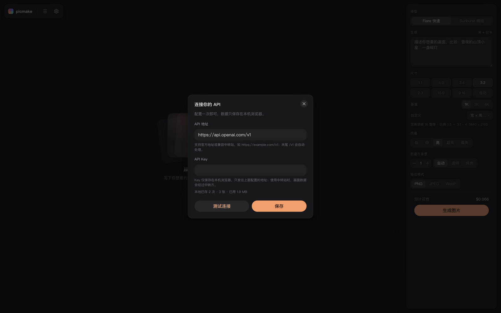
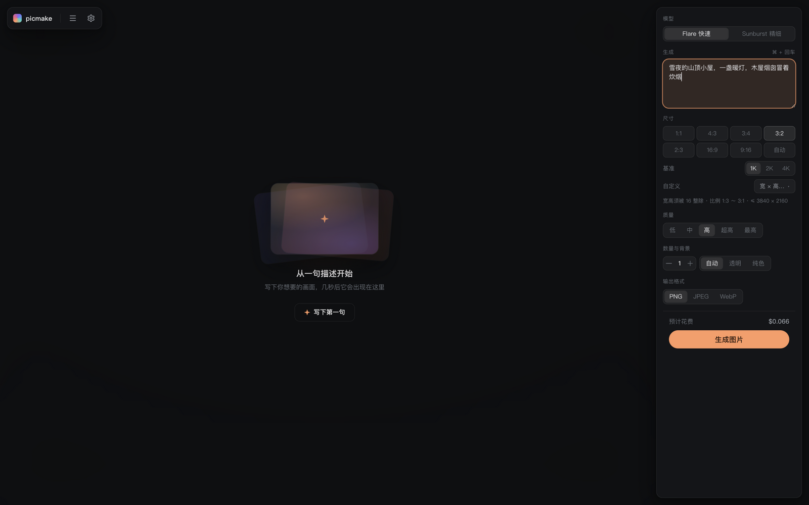

<div align="center">


# PicMake

GPT Image 2.5 生图工作台 —— 纯前端，图片和花费只存在你自己的浏览器里

[](https://picmake.crisweb.com)
[](./LICENSE)

</div>



GPT Image 2.5 是 OpenAI 目前最强的生图 API，但官方只给了 API，没有独立客户端；走中转站的用户更是连个顺手的入口都没有。PicMake 补的就是这块：打开网页、填上自己的 API 地址和 Key，就能带着完整参数控制和本地历史生图——无后端、无账号、无遥测，所有数据不出本机。

## 功能

- **流式渐进预览** —— 生图过程按 SSE 流式渲染，从模糊色块逐步清晰到成图，和 ChatGPT 里生图的观感一致
- **中转站友好** —— 地址自动补全 `/v1`；流式被拒自动降级为普通请求；异步任务型接口（返回 `task_id` 需轮询）也能出图；失败绝不重发请求，同批图不会计费两次
- **全参数** —— Flare / Sunburst 双模型、8 种比例加自定义像素（16 整除实时校验）、五档质量、1–4 张、透明或纯色背景、PNG / JPEG / WebP
- **花费透明** —— 参数一动预估价即时刷新；最高档或 4K 大尺寸会先弹确认框再花钱
- **历史在本地** —— 作品与花费记录存 IndexedDB，可回看、复用参数再生成、灯箱大图轮播；清除站点数据即彻底删除

| 首次运行，填一次 Key | 参数与实时估价 |
| --- | --- |
|  |  |

## 快速开始

```bash
git clone https://github.com/crisweb1994/PicMake.git
cd PicMake
pnpm install
pnpm dev        # → http://localhost:5173
```

浏览器打开后填 API 地址与 Key（官方 `https://api.openai.com/v1`，或任意 OpenAI 格式兼容的中转站），「测试连接」通过即可开始生成。

> [!NOTE]
> 本地开发同理：Key 只写进浏览器 localStorage，全程没有任何服务器参与。

## 部署

构建产物是纯静态文件，任意静态托管都能用，仓库已带两家的配置：

- **Vercel**：[vercel.com/new](https://vercel.com/new) 导入仓库即可，`vercel.json` 已声明构建与输出目录
- **Cloudflare Pages**：面板连接仓库，构建命令 `pnpm build`、输出目录 `dist`（`wrangler.toml` 已声明）；或 `pnpm build && npx wrangler pages deploy dist` 直接上传

环境要求 Node ≥ 20.19、pnpm ≥ 10（见 `.nvmrc` 与 `package.json` 的 `engines`）。

> [!TIP]
> Pages 项目的 Deploy command 保持留空即可，构建完成后 Cloudflare 会自动上传 `dist`。不要填 `npx wrangler deploy`——那是部署 Worker 脚本的命令，对纯静态项目会报 `Missing entry-point`。

## Key 与数据的边界

> [!IMPORTANT]
> API Key 只存浏览器 localStorage，只在请求头 `Authorization` 中发往你配置的地址。本应用无账号、无后端、无任何遥测；图片与历史只写 IndexedDB。

纯前端应用挡不住同源 XSS：请在自己信任的环境中使用，不要在公共设备上保存 Key。

## 技术栈

Vite 8 · React 19 · TypeScript · Tailwind CSS v4 · HeroUI v3 · Zustand · Dexie · eventsource-parser。网络层是原生 fetch 封装（`/v1` 归一化、错误归一化、流式与自动降级），不引 axios，也不引官方 SDK。

---

⭐ 如果 PicMake 帮到了你，欢迎 [点个 star](https://github.com/crisweb1994/PicMake)。
